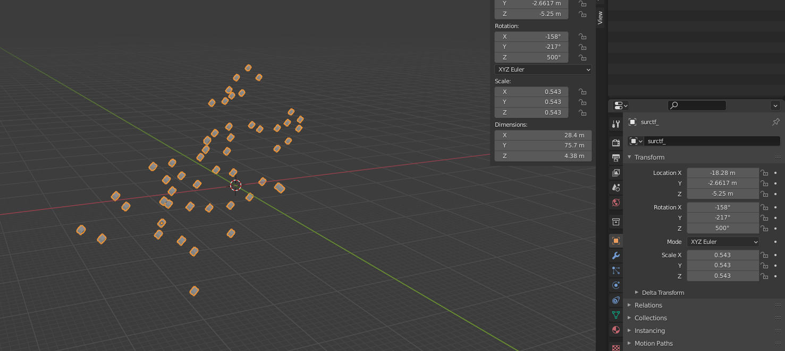
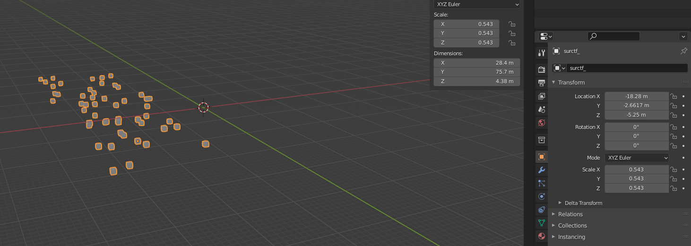
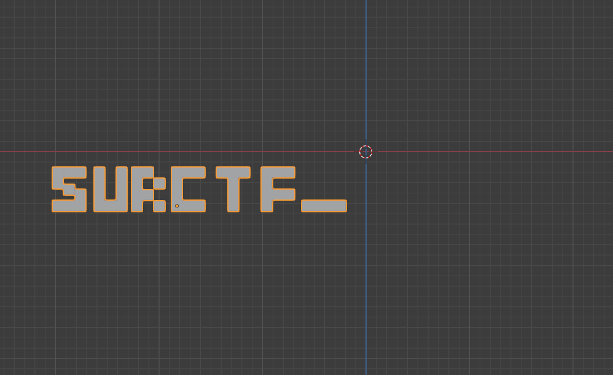

Дисклеймер: таск оказался уцуцугой, я поздно это понял, простите.

В чем заключалось задание. Открываем любой файл, например 1й. У нас есть кубики каким-то образом расставленные в пространсте. Крутимся вертимся, тыкаем сюда и туда, не понимаем что же делать.  

Вспоминаем название таска "ORTOROT". **ROT** - очевидно(наверное) вращение. Пробуем обнулить значения **Rotation**(справа на картинке) группы кубов. Получаем: 

Крутимся вертимся камерой, если повезет найдем флаг, но скорее всего нет. Поэтому думаем дальше. **ORTO** - не менее очевидно(нет) от слова ортографический. Гуглим как включить ортогррафический вид в блендере, нажимаем NUM5 и включаем его. Крутимся вертимся в этот режиме и видим:  

Ну и так далее находятся остальные части флага.

>Флаг: surctf_ort0rot_sounds_like_behemot
