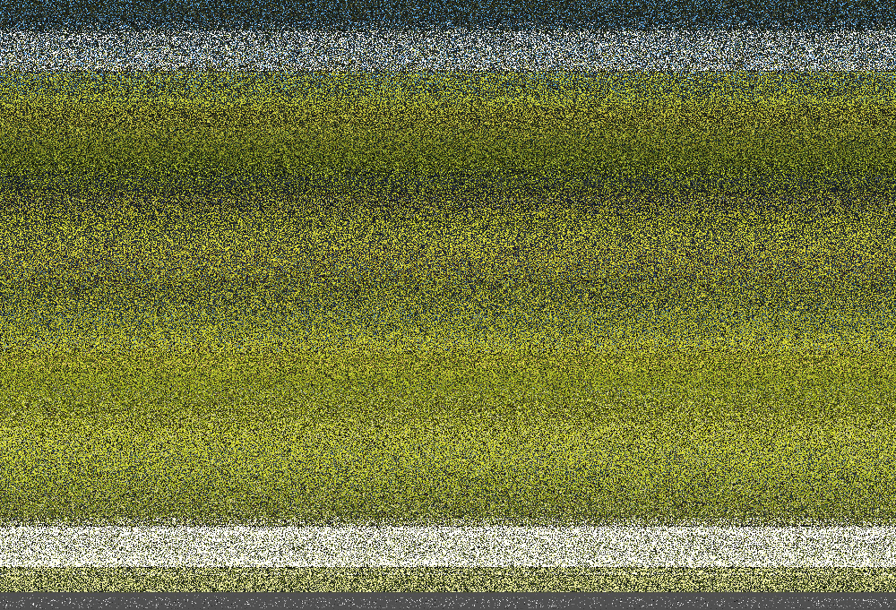

Открываем изображение [enc.png](enc.png), и понимаем, что ничего не понимаем.


Открываем [encrypt.py](encrypt.py) и видим, что для шифрования используются какие-то две библиотеки: cv2 и numpy. Гуглим, узнаем, что numpy - это библиотека для работы с массивами, cv2 - для работы с компьютерным зрением, изображениеями.
Пытаемся понять, что происходит в коде.

Видим функцию:
```python3
def get_true_random_number():
    np.random.seed(np.random.randint(1000000))
    return np.random.randint(10000000)
```
Из названия понимаем, что по задумке автора функция должна генерировать **"истинно случайные числа"**. Смотрим внутрь, видим, что каждый вызов функции устанавливается новый **np.random.seed**, причем вычисляется он вызовом функции **randint(100000)** из библиотеки numpy, опять гуглим, видим, что эта функция генерит случайное число от 0 до переданного значения(не включая его).

**Seed** - это начальное число или семя. Оно используется в генераторах псевдослучайных чисел(дада, на самом деле случайные числа в питоне чаще всего не случайны). При одинаковых seed, последовательные вызовы любой завязанной на случайности функции, буду выдавать одни и теже значения. То есть, если мы укажем **seed = 1337** и при вызовае трех **randint** у нас будут числа **(3, 13, 223)**, то в след.раз, когда мы снова установим **seed = 1337**, то следующие три вызова выдадут те же самые **(3, 13, 223)**.

Идем дальше. В строчках:
```python3
img = cv2.imread("src.png")

IMG_W = img.shape[1]
IMG_H = img.shape[0]
```
В переменную **img** записывается массив из значений пикселей изображения "src.png". В переменные **IMG_W** и **IMG_H** - ширина и высота изображения соответственно.

В строках:
```python3
enc_img = np.zeros(img.shape, dtype="uint8")
np.random.seed(IMG_W * IMG_H * 666)
```
Генерируется массив из нулей, такого же размера что и наше изображение, и устанавливается **np.random.seed** равный произведению **IMG_W**, **IMG_H** и числа 666.

Идем дальше, встречаем цикл: 
```python3
for i in range(IMG_H):
    np.random.seed(get_true_random_number())
    shuffle_map = np.arange(IMG_W)
    np.random.shuffle(shuffle_map)

    for j in range(IMG_W):
        enc_img[i, j] = img[i, shuffle_map[j]]
```
Пытаемся понять, что в нём происходит. Каждую итерацию **i** устанавливается новый **seed**, с помощью функции **np.arange(IMG_W)** создается **shuffle_map**. Гуглим, что такое **np.arange**, узнаем что с помощью этой функции можно получить ряд чисел в интервале **[0, n)**. Дальше  к **shuffle_map** применяется функция **np.random.shuffle**, которая перемешивает значения этого ряда. После этого мы входим в новый цикл, в котором каждому **j-му** пикселю **i-й** строки **enc_img** сопоставляется **shuffle_map[j]-й** пиксель **i-й** строки **img**(исходного изображения) Т.е. пиксели строк перемешиваются в соответствии с **shuffle_map**.

Встает вопрос, если на каждой итерации **i** у нас устанавливается новый случайный **seed**, а после случайным образом перемешиваются пиксели, то каким образом нам расшифровать изображение обратно. Но если мы вернемся немного назад, мы увидим, что **seed** изначально равняется:
```python3
np.random.seed(IMG_W * IMG_H * 666)
```
А значит, если у нас есть начальный **seed**, то у нас есть и все последующие случайные значения. Немного подумав, как же все таки нужно изменить код, чтобы зашифрованное изображение расшифровалось, мы поймем, что достаточно изменить одну строчку:
```python3
enc_img[i, j] = img[i, shuffle_map[j]]
```
на
```python3
dec_img[i, shuffle_map[j]] = enc_img[i, i]
```
То есть делаем обратную операцию. Где **dec_img** - это пустой массив, в которые мы записываем расшифрованное изображение, а **enc_img** массив пикселей зашифрованного изображения.
В итоге получаем:


Код для расшифровки: [decrypt.py](decrypt.py)

>Флаг: surctf_2021_puzzles_are_weird
