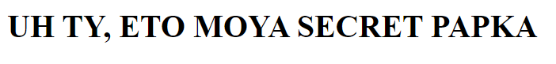

Потыкав в папки, можно заметить, что когда мы нажимаем на правильную папку, она появляется в ссылке, а когда на неправильную, мы попадаем в начало.

Конечно, можно решить это задание руками, но зачем их занимать, если мы можем просто написать скрипт, который будет делать всё за нас? В этом же и суть заданий категорий PPC

Пример скрипта:

[solver.py](source/solver.py)

```python

import requests as req


def process(url):
    letters = [chr(c) for c in range(97, 123)]
    letters.append('-')

    for letter in letters:
        r = req.get(url+f'{letter}/')
        if len(r.url) > len(url):
            print(r.url)
            process(r.url)


if __name__ == '__main__':
    process('http://surctf.ru:1336/')
```

В результате получаем такую ссылку:
http://surctf.ru:1336/s/u/r/c/t/f/-/m/e/c/h/a/n/i/c/a/l/-/w/a/y/-/i/s/-/n/o/t/-/a/-/l/e/g/i/t/-/s/o/l/u/t/i/o/n/-/b/u/t/-/y/o/u/-/c/o/u/l/d/-/t/r/y/

А при переходе на неё замечаем такую страницу:



Понимаем, что ссылка и является флагом.

Убираем все слеши, подгоняем ссылку под формат флага и получаем его: 

`surctf_mechanical_way_is_not_a_legit_solution_but_you_could_try`
