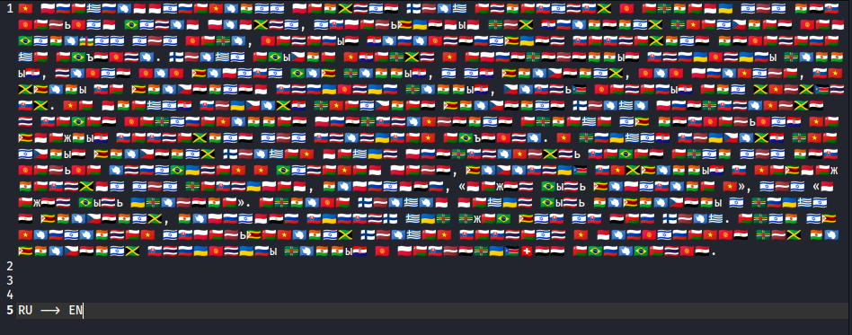

Открываем `file.docx` и сразу видим очень странные буковки и шрифт из эмодзи, меняем кодировки и начинаем видеть флаги разных стран, а также пару букв, например: `ь ж ъ ы`

Сначало удивляемся, почему же там русские буквы, начинаем прикидывать, создатель не знает английского языка, значит тут зашифрован текст на русском. 
Очень даже похоже, что на эти буквы нельзя назвать страну с флагом, значит тут у кажой буквы есть флаг страны на эту букву.

Пробуем декодировать и получаем текст:

> В программировании понятие флаг относится к одному или нескольким битам памяти, используемым для хранения двоичной комбинации или кода, который характеризует состояние некоторого объекта. Флаги обычно входят в определённые структуры данных, такие как записи баз данных, и их значения, как правило, связаны со значением структур данных, частью которых они являются. Во многих случаях двоичное значение флага представляет собой кодированное представление одного из нескольких возможных состояний или статусов объекта. В других случаях двоичные значения флагов могут представлять собой один или несколько атрибутов в битовом поле, зачастую связанных с возможностями или доступом, например, «может быть записано в», или «может быть удалено». Однако флагам могут быть назначены и другие значения, например сурстф_гуд_джоб_зис_ис_йор_флаг. Один из вариантов использования флагов состоит в маркировке для назначения структуры данных к последующей обработке.

Видим флаг и ниистово радуемся нашей победе в этом непростом таске, но перед сдачей ОБЯЗАТЕЛЬНО не забудьте перевести флаг `RU -> EN`, а то не получится сдать :c

`Флаг: surctf_good_job_this_is_your_flag`
