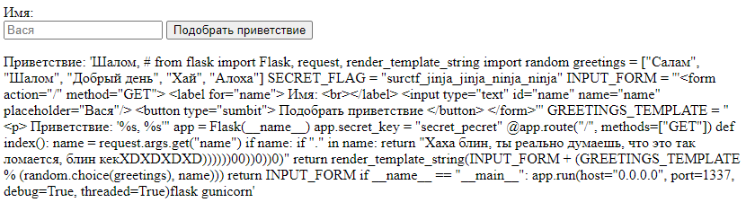

Заходим на сайт, видим что здесь всего одно поле. Пытаемся напихать внего кучу разного типа инъекций и т.д., чтобы понять есть ли какая-либо уязвимость.
Если вам повезло и вы знаете про jinja инъекции или вы смогли их нагуглить, то вы увидите, что вписав в поле **{{ что-то }}**, то **что-то** исполнится как питоновский код.
Гуглим, каким образом можно прочитать файлы с помощью питоновских объектов и как до них добраться через jinja инъекцию и формируем строчку запроса, которая всё сделает.

У меня получилось вот так:
```
{{ ''['__class__']['__mro__'][1]['__subclasses__']()[182]()["_module"]["__builtins__"]['__import__']('os')['popen']("cat *")['read']() }}
```

Смотрим полученный вывод:


И видим в коде сервиса, что во-первых, алгоритм оказывается намного сложнее чем в условии таска, и что существует некая переменная **SECRET_FLAG** в которой находится флаг.

> Флаг: surctf_jinja_jinja_ninja_ninja
