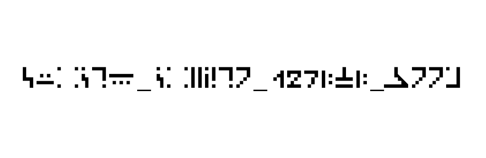

Видим:

Понимаем, что на изображении шифр из майнкрафта, думаем, гуглим, как же его расшифровать и узнаем, что оказывается каждому символу соответсвует символ из английского алфавита. Сопоставляем, получаем флаг.

Флаг: surctf_crypto_127lvl_boom
