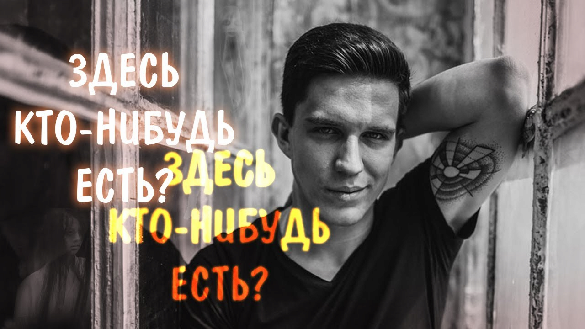
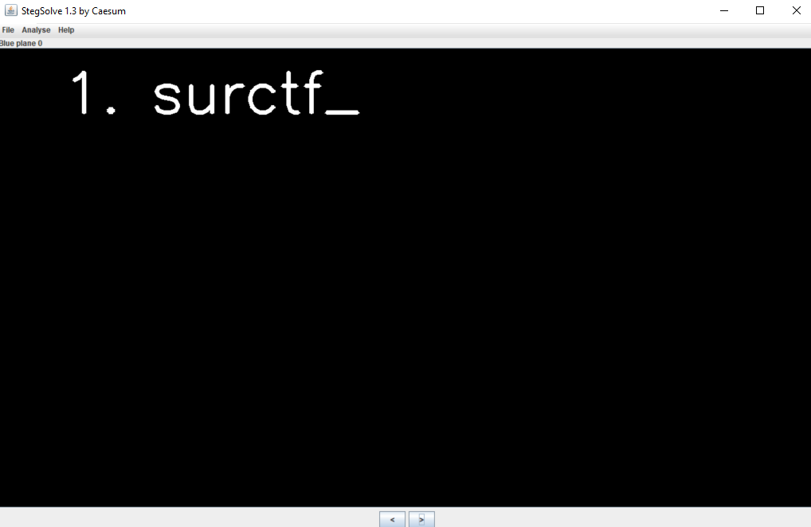
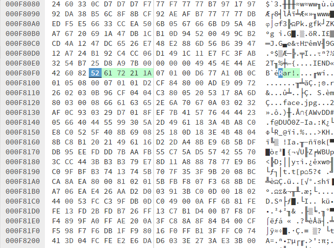
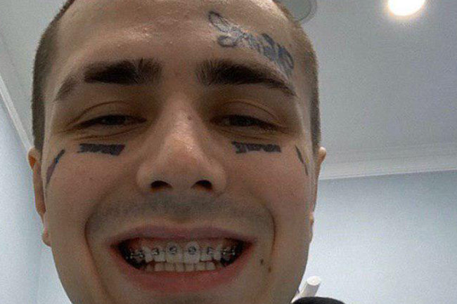
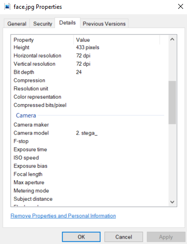
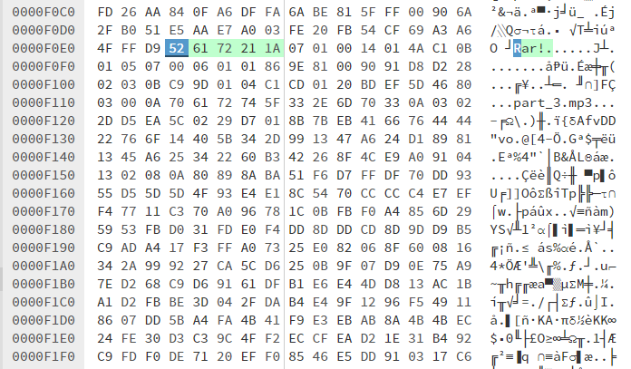

Открываем картинку:

В ней нас встречает **Дима**.

Вспоминаем, что это стега, закидываем в **stegsolve**. Крутим вертим различные режимы и вдруг видим **1. surctf_** в **"Blue pane 0"**:

Вот она! Первая часть флага. Понимаем, что она не одна, идем дальше. 

Так-как в png файлах метаданных нет, залазим в hex. Листаем, читаем и видим, что после закрывающего чанка **IEND** идет подпись **Rar!**, что кажется, намекает нам на **rar** архив.

Открываем картинку как **rar** архив и видим в ней другую картинку:

Пугаемся. Приходим в себя. Думаем. Расширение **.jpg**, значит есть метаданные, лезим в них, находим вторую часть флага в поле **Camera model**:

Кидаем картинку в stegsolve, увы, ничего не находим. Опять лезим в hex. Листаем, читаем и опять встречаем подпись **Rar!**, либо имя файла part_3.mp3, что намекает нам, что внутри картинки есть еще что-то.

Открываем эту картинку как rar архив и видим **[part_3.mp3](hidden/part_3.mp3?raw=1)**. Слушаем его и узнаем что: "Третья часть флага **never_been**".

Пытаемся сдать эти три части и понимаем, что это еще не весь флаг. Вспоминаем, что у mp3 файлов тоже есть метаданные, лезим в них и видим, что в поле **Composers** лежит четвертая часть флага: **"4. \_so_cringe_"**.

Сдаем флаг. Кстати, сказку то вспомнили?

> Флаг: surctf_stega_never_been_so_cringe
