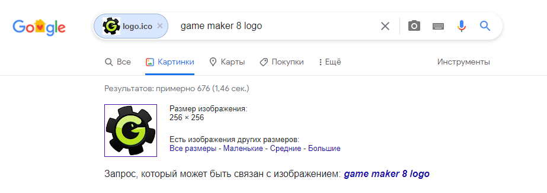
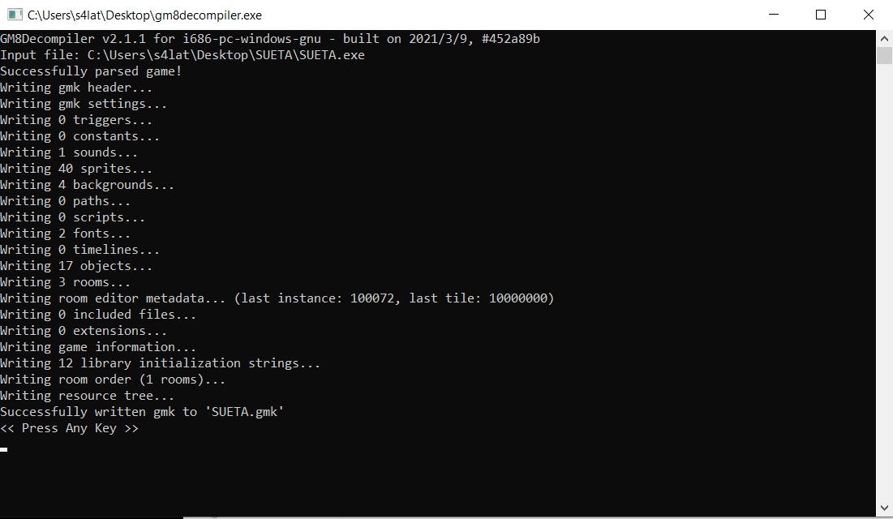
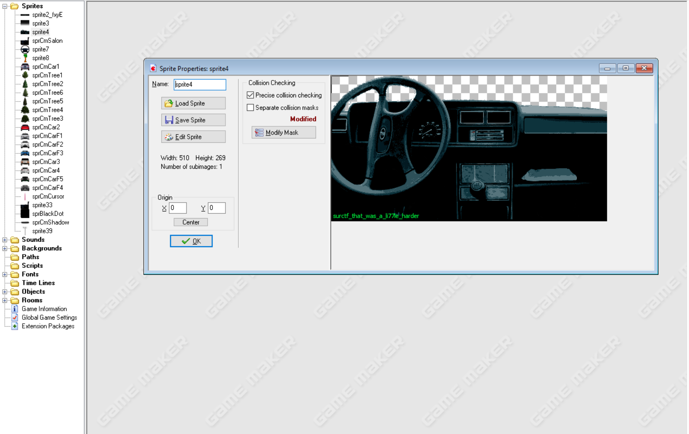

Наигрываем 10к часов и понимаем, что флага нет. Думаем, что же делать? Может попробовать декомпилировать игру?
Если вы уже пытались делать что-то в Game Maker, то сразу поймете, что можно скачать декомпилер. Иначе, делаем поиск по картинке иконки игры и узнаем, что это лого Game Maker 8.  

Гуглим декомпилеры, находим [GM8Decompiler](https://github.com/OpenGMK/GM8Decompiler/releases).  
Скачиваем, закидываем в него нашу игру, успешно декомпилим.  

Скачиваем сам GameMaker 8 и открываем через него полученные **.gmk** файл. Залазим в папку **Sprites**. Заглядываем в sprite4 и находим неиспользованный спрайт в котором записан наш флаг.  

> Флаг: surctf_that_was_a_li77le_harder
