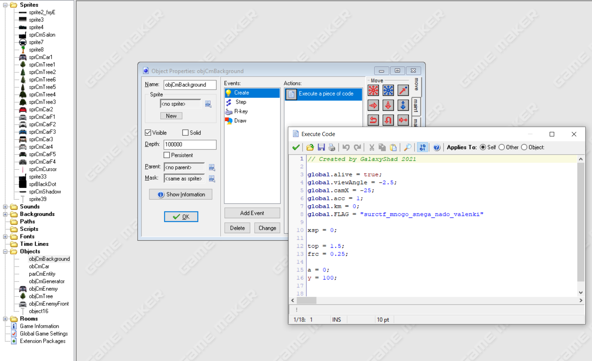

Делаем всё тоже самое, что и в sueta_2, но теперь заходим в папку Objects. Открываем objCmBackground, смотрим, что за код в нём записан и видим в нем переменную FLAG с нашим флагом.  

> Флаг: surctf_mnogo_snega_nado_valenki
