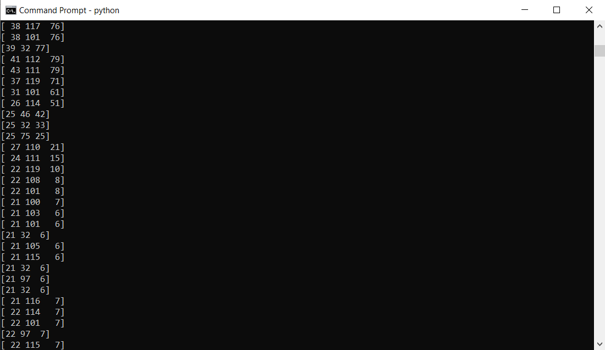
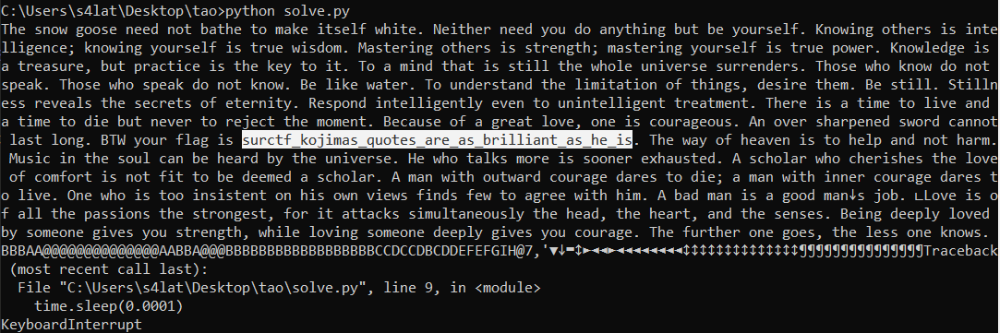

Солвер: [solve.py](solve.py)

Открываем картинку:  

Кидаем во всякие стегсолы, лезим в hex, ничего не находим.  
Всматриваемся в картинку, замечаем в самом верху полоску странных пикселей. Читаем их значения. Замечаем, что в зеленом канале все значения подходят под диапазон английских символов в таблице ASCII.
  
Пишем простенький [скрипт](solve.py), которые переведет значения красного канала в буквы и получаем невероятное послание от гения. В нём флаг.  
  

> Флаг: surctf_kojimas_quotes_are_as_brilliant_as_he_is
