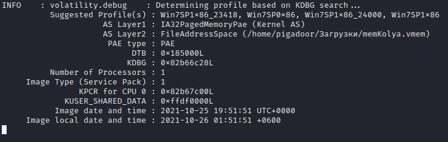
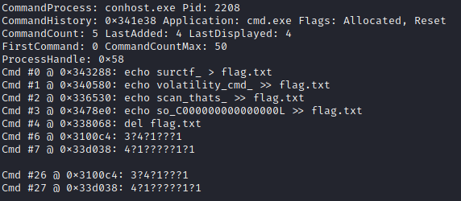
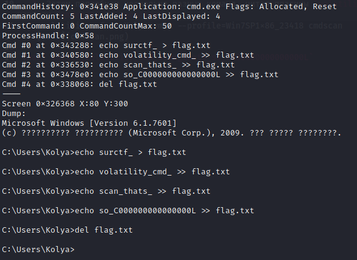

Видим интересный файл `memKolya.vmem.zst`:

1. Гуглим `zst` - понимаем, что это архив и его можно разархивировать командой `zstd`.

   - linux: `apt install zstd`

   - windows: `https://github.com/facebook/zstd/releases/download/v1.4.4/zstd-v1.4.4-win64.zip`

2. Разархивируем архив командой `zstd -d memKolya.vmem.zst`.

3. Продолжаем гугить `vmem` - узнаем, что это виртуальная память и с помощью `volatility` можно исследовать эту память:

   1. Для начала узнаем профиль: 

      - > volatility -f memKolya.vmem imageinfo
        

   2. Затем попробуем несколько разных команд, читая плагины `volatility`. В какой-то момент мы поподаем на команду `cmdscan` и `consoles` (выводят историю команд из CMD и PowerShell):

      - > volatility -f memKolya.vmem --profile=Win7SP1x86_23418 cmdscan
        

      - > volatility -f memKolya.vmem --profile=Win7SP1x86_23418 consoles
        

   3. Находим флаг из нескольких частей - радуемся, ликуем, улыбаемся, хлопаем себе, мы молодцы!!!

`Флаг: surctf_volatility_cmd_scan_thats_so_C000000000000000L`
